# ETL Homework - SF Restaurant Yelp and Health Score 

Background 

This project was an Extract, Transform and Load Project that was projected onto a HTML Webpage. This was done in conjunction with two team members who worked on the webpage and Flourish which was a data visiualization tool. 

Tools 

## Step 1 - Juypter Notebook 

I used Jupyter Notebook, filter the data 

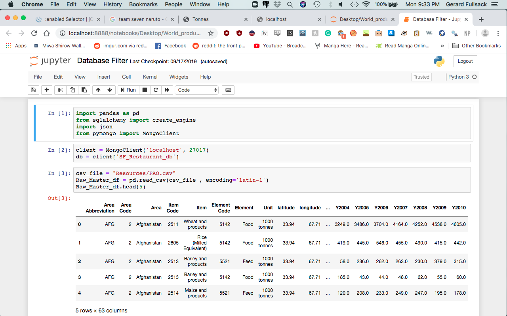

This was the first Scatter Graph that was created plotted using the Restaurant's Yelp Score and Health score, what's shows is that a majority of Restaurants that are 4 stars range In health from 75-90

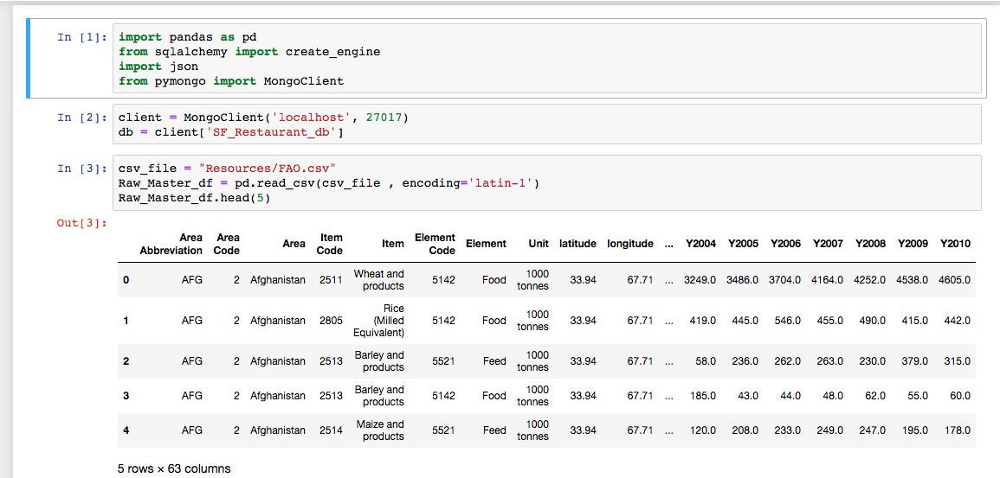

In order to better understand the density of the Restaurants, I created a "Heat Map" that shows a majority of restaurants that are highly rated are at 4 Stars, 85-90 However a Correlation score of 0.24058599175401413 means its a weak connection. 

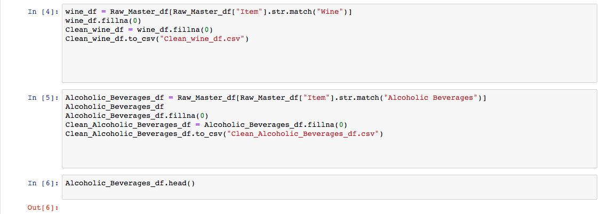

In order to combat a myth of Asian Restaurants having poor healthscores while highly rated, we configured the project to just have Asian Restaurants, however due to the limited amount of restaurants in SF / Yelp Processors it's much smaller. Overall there isn't a true correlation 

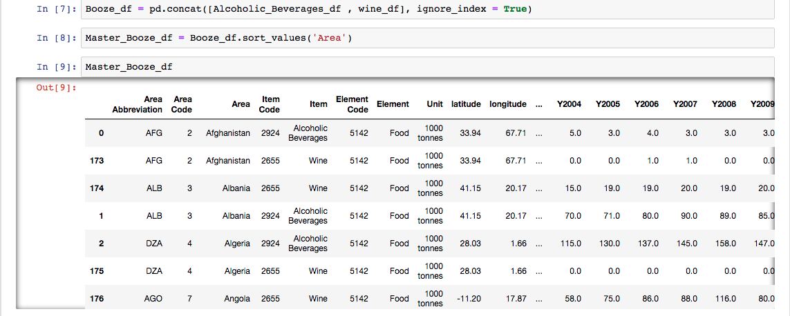

The heat map also shows the same, with a Correlation score of 0.29407249289773696, it's a weak connection. 

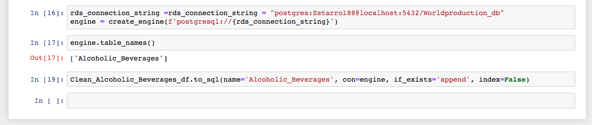

## The Transformer Graph 

I used HTML in order to capture the data and project it. 

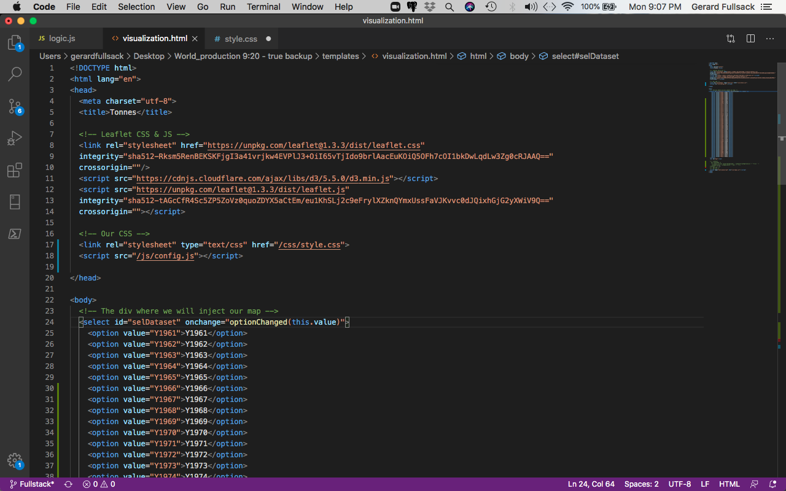

This is the setup to the YELP API Processor, this is the payload that I configured, where I would search for all restaurant posting that has a location in San Francisco 

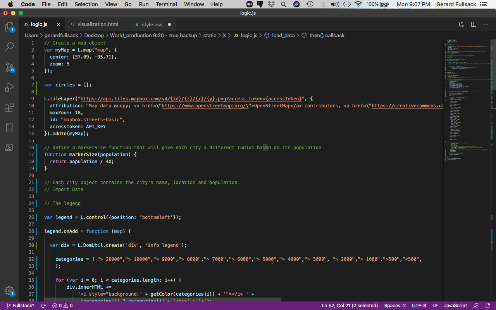

I followed the guidelines and instructions provided by yelp and pulled batches of 50 for a total of 1000 restaurants. 

I also broke down the processor into batches where if at any point there was a failure I would know at what point it failed. 

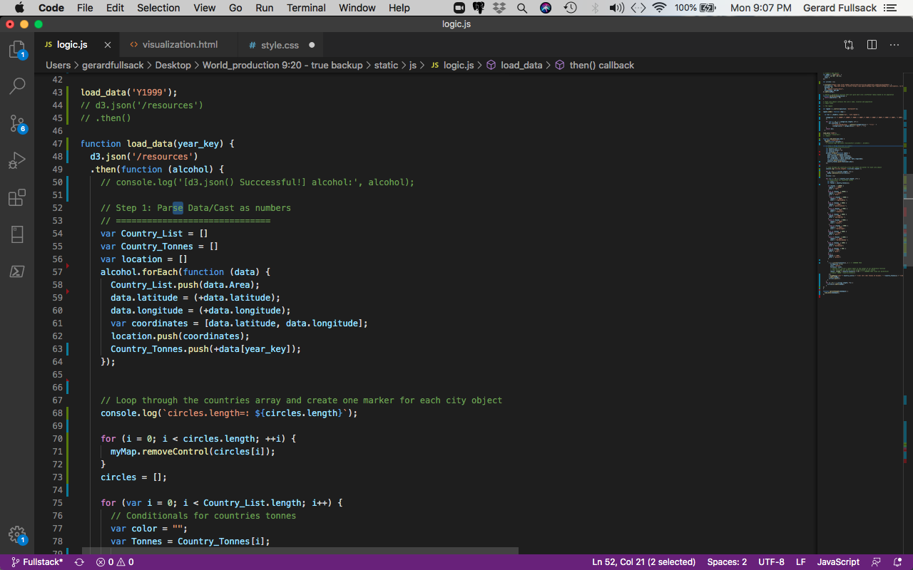

After Processing batches of 50, here is the 1000 restaurants I could pull from the YELP API that I converted from JSON to Data Frame and exported as a CSV 

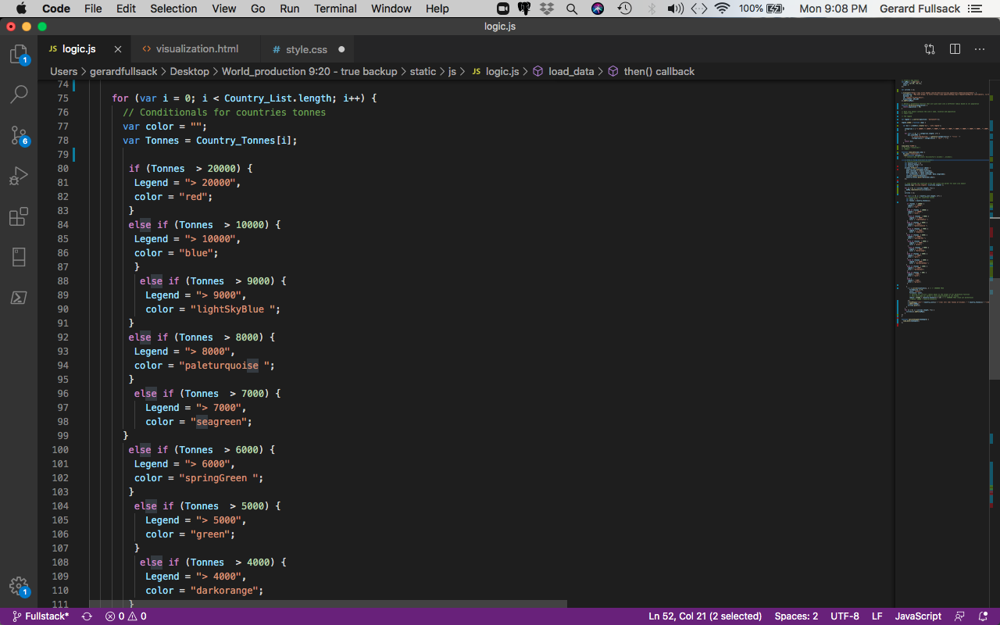

This is the setup to the YELP API Processor, this is the payload that I configured, where I would search for all restaurant posting that has a location in San Francisco 

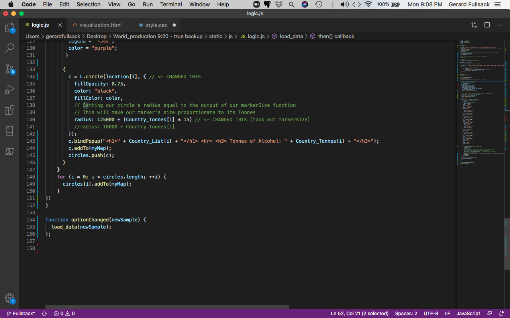

I followed the guidelines and instructions provided by yelp and pulled batches of 50 for a total of 1000 restaurants. 

I also broke down the processor into batches where if at any point there was a failure I would know at what point it failed. 

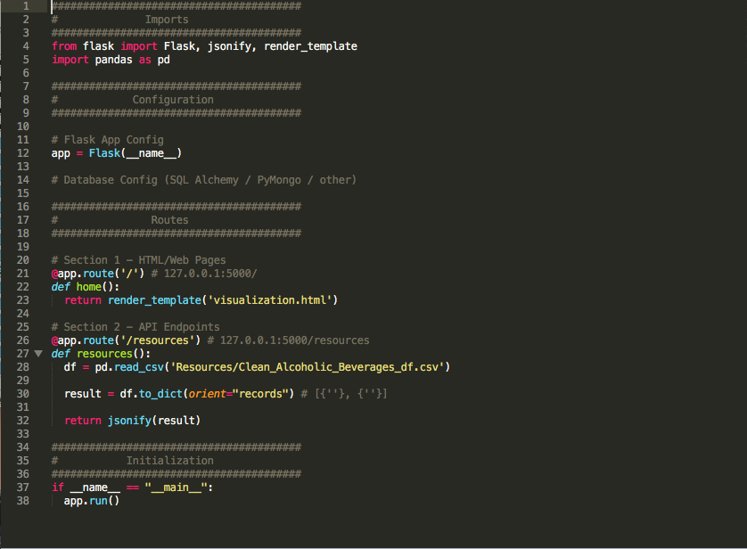

After Processing batches of 50, here is the 1000 restaurants I could pull from the YELP API that I converted from JSON to Data Frame and exported as a CSV 

## The Map 

I used HTML in order to capture the data and project it. 

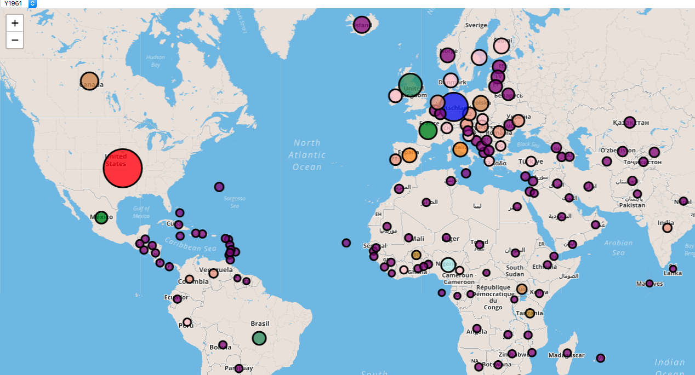

This is the setup to the YELP API Processor, this is the payload that I configured, where I would search for all restaurant posting that has a location in San Francisco 

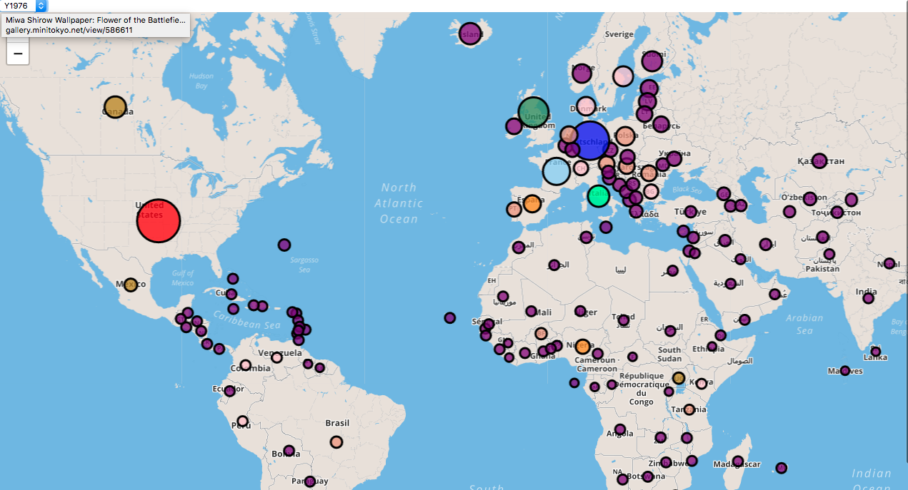

I followed the guidelines and instructions provided by yelp and pulled batches of 50 for a total of 1000 restaurants. 

I also broke down the processor into batches where if at any point there was a failure I would know at what point it failed. 

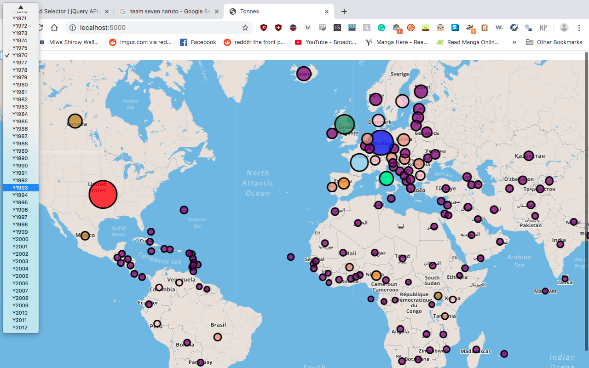

After Processing batches of 50, here is the 1000 restaurants I could pull from the YELP API that I converted from JSON to Data Frame and exported as a CSV 

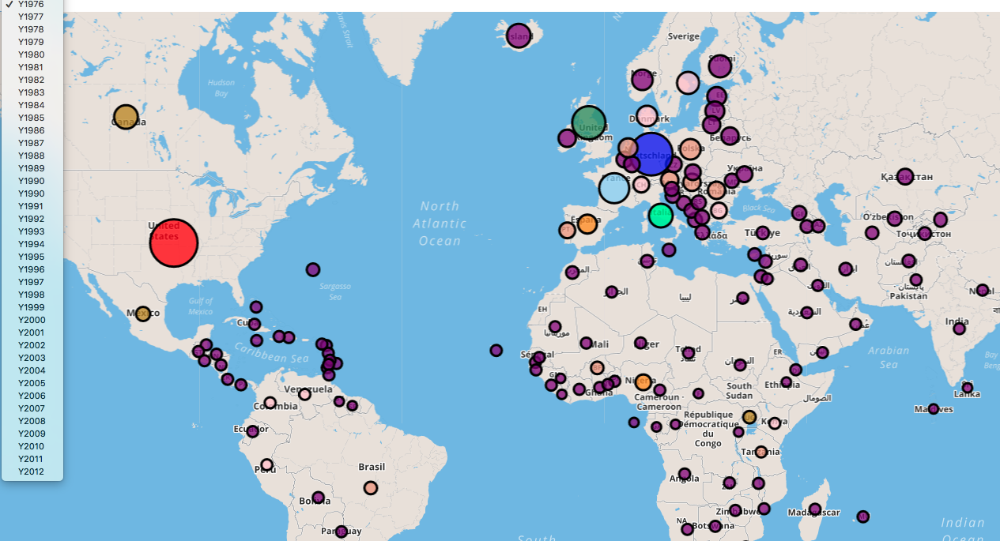

This is the setup to the YELP API Processor, this is the payload that I configured, where I would search for all restaurant posting that has a location in San Francisco 

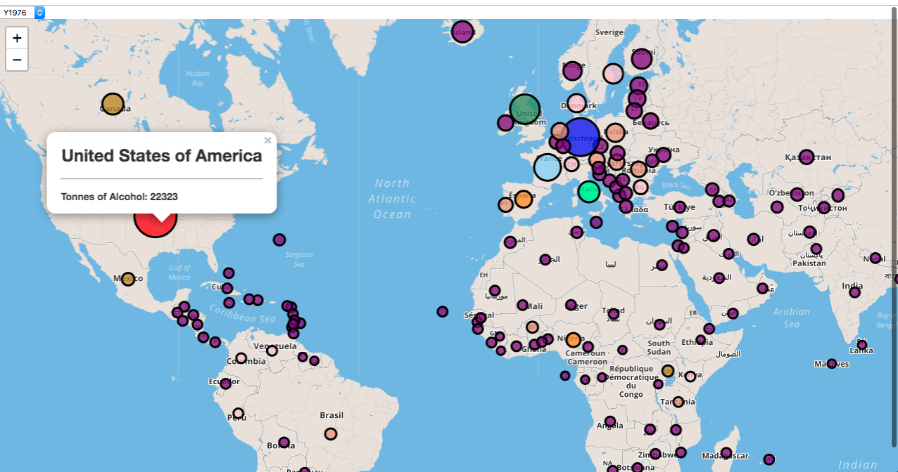

## Conclusion 

A majrity of people seem to not really care about health scores when in consideration with their yelp score, however moving forward in order to expand on this would be to gather Health Scores in the greater Bay Area in order to improve the model. 

Additionally would be a better fine tuning in order to prevent "loss" of data when merging and transforming data. 

- - -

